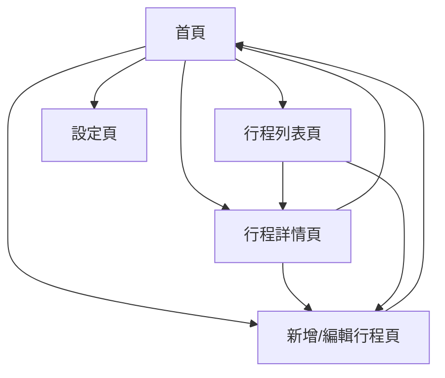

# 行事曆管理系統 - 產品需求文檔 (PRD)

## 1. 產品概述

行事曆管理系統是一個現代化的日程管理應用，幫助用戶高效地創建、管理和追蹤個人及團隊行程安排。

該系統解決了用戶在日常生活和工作中的時間管理問題，提供直觀的界面讓用戶輕鬆安排會議、提醒事項和重要活動。

目標是成為用戶首選的數位行事曆工具，提升時間管理效率和生活品質。

## 2. 核心功能

### 2.1 用戶角色

| 角色 | 註冊方式 | 核心權限 |
|------|----------|----------|
| 一般用戶 | 電子郵件註冊 | 可創建、編輯、刪除個人行程，設置提醒 |
| 進階用戶 | 付費升級 | 可創建團隊行程、邀請他人、匯出行程資料 |

### 2.2 功能模組

我們的行事曆管理系統包含以下主要頁面：

1. **首頁**：月曆視圖、快速新增行程、今日行程概覽
2. **行程詳情頁**：行程完整資訊、編輯功能、參與者管理
3. **新增/編輯行程頁**：行程表單、時間選擇、提醒設置
4. **行程列表頁**：所有行程清單、篩選排序、批量操作
5. **設定頁**：個人偏好、通知設定、帳戶管理

### 2.3 頁面詳情

| 頁面名稱 | 模組名稱 | 功能描述 |
|----------|----------|----------|
| 首頁 | 月曆視圖 | 顯示當月行程，支援月/週/日視圖切換，點擊日期可查看詳情 |
| 首頁 | 快速新增 | 提供快速新增行程按鈕，支援拖拽時間段創建行程 |
| 首頁 | 今日概覽 | 顯示今日行程摘要，包含時間、標題、重要程度標示 |
| 行程詳情頁 | 行程資訊 | 顯示行程完整資訊：標題、時間、地點、描述、參與者 |
| 行程詳情頁 | 編輯功能 | 提供編輯、刪除、複製行程功能，支援重複行程設定 |
| 新增/編輯行程頁 | 行程表單 | 包含標題、開始/結束時間、地點、描述等必填和選填欄位 |
| 新增/編輯行程頁 | 時間選擇 | 提供日期時間選擇器，支援全天行程和重複行程設定 |
| 新增/編輯行程頁 | 提醒設置 | 設定行程提醒時間：15分鐘前、1小時前、1天前等選項 |
| 行程列表頁 | 行程清單 | 以列表形式顯示所有行程，支援分頁載入和無限滾動 |
| 行程列表頁 | 篩選排序 | 按日期、類別、重要程度篩選，支援關鍵字搜尋 |
| 設定頁 | 個人偏好 | 設定預設視圖、時間格式、週開始日等個人化選項 |
| 設定頁 | 通知設定 | 管理推送通知、郵件提醒、聲音提示等通知方式 |

## 3. 核心流程

**主要用戶操作流程：**

用戶進入首頁查看月曆視圖和今日行程概覽，可以點擊快速新增按鈕或拖拽時間段來創建新行程。創建行程時會跳轉到新增行程頁面，填寫行程資訊並設定提醒。行程創建後返回首頁，用戶可以點擊行程查看詳情或進行編輯。在行程列表頁可以查看所有行程並進行批量管理。設定頁面允許用戶自訂個人偏好和通知選項。



## 4. 用戶界面設計

### 4.1 設計風格

- **主要色彩**：主色調 #2563EB (藍色)，輔助色 #F3F4F6 (淺灰)
- **按鈕樣式**：圓角按鈕，主要按鈕使用漸層效果
- **字體**：Noto Sans TC，標題 18-24px，內文 14-16px
- **佈局風格**：卡片式設計，頂部導航，響應式佈局
- **圖示風格**：使用 Heroicons 圖示庫，簡潔線條風格

### 4.2 頁面設計概覽

| 頁面名稱 | 模組名稱 | UI 元素 |
|----------|----------|----------|
| 首頁 | 月曆視圖 | 網格式月曆，每日格子顯示行程數量，當日高亮顯示，支援左右切換月份 |
| 首頁 | 快速新增 | 浮動新增按鈕 (FAB)，位於右下角，點擊展開快速表單 |
| 首頁 | 今日概覽 | 側邊欄或底部卡片，顯示今日行程時間軸，使用不同顏色標示行程類型 |
| 行程詳情頁 | 行程資訊 | 大標題顯示行程名稱，卡片式佈局展示時間、地點等資訊 |
| 新增/編輯行程頁 | 行程表單 | 垂直表單佈局，清晰的欄位標籤，輸入框使用圓角邊框 |
| 行程列表頁 | 行程清單 | 列表項目使用卡片設計，左側顯示時間，右側顯示標題和簡介 |
| 設定頁 | 個人偏好 | 分組設定項目，使用開關和下拉選單，清晰的分隔線 |

### 4.3 響應式設計

採用桌面優先設計，支援平板和手機適配。在手機版本中，月曆視圖改為週視圖，側邊欄改為底部抽屜，確保觸控操作友好。

## 5. 技術架構設計

### 5.1 前端技術棧
- **框架**：React 18 + TypeScript
- **狀態管理**：Zustand
- **UI 組件庫**：Tailwind CSS + Headless UI
- **路由**：React Router v6
- **日期處理**：date-fns
- **表單處理**：React Hook Form + Zod

### 5.2 後端技術棧
- **運行環境**：Node.js + Express
- **數據庫**：PostgreSQL + Prisma ORM
- **身份驗證**：JWT + bcrypt
- **API 設計**：RESTful API
- **檔案上傳**：Multer

### 5.3 部署架構
- **前端部署**：Vercel 或 Netlify
- **後端部署**：Railway 或 Heroku
- **數據庫**：PostgreSQL (Supabase 或 Railway)
- **CDN**：Cloudflare

## 6. 數據模型設計

### 6.1 核心數據表

**用戶表 (users)**
```sql
id: UUID (主鍵)
email: VARCHAR(255) (唯一)
password_hash: VARCHAR(255)
name: VARCHAR(100)
avatar_url: VARCHAR(500)
timezone: VARCHAR(50)
created_at: TIMESTAMP
updated_at: TIMESTAMP
```

**行程表 (events)**
```sql
id: UUID (主鍵)
user_id: UUID (外鍵)
title: VARCHAR(200)
description: TEXT
start_time: TIMESTAMP
end_time: TIMESTAMP
location: VARCHAR(200)
is_all_day: BOOLEAN
recurrence_rule: VARCHAR(500)
reminder_minutes: INTEGER[]
created_at: TIMESTAMP
updated_at: TIMESTAMP
```

**提醒表 (reminders)**
```sql
id: UUID (主鍵)
event_id: UUID (外鍵)
user_id: UUID (外鍵)
reminder_time: TIMESTAMP
is_sent: BOOLEAN
created_at: TIMESTAMP
```

### 6.2 數據關係
- 用戶與行程：一對多關係
- 行程與提醒：一對多關係
- 支援重複行程的規則存儲

## 7. API 接口設計

### 7.1 用戶相關 API
```
POST /api/auth/register - 用戶註冊
POST /api/auth/login - 用戶登入
POST /api/auth/logout - 用戶登出
GET /api/users/profile - 獲取用戶資料
PUT /api/users/profile - 更新用戶資料
```

### 7.2 行程相關 API
```
GET /api/events - 獲取行程列表 (支援日期範圍篩選)
POST /api/events - 創建新行程
GET /api/events/:id - 獲取行程詳情
PUT /api/events/:id - 更新行程
DELETE /api/events/:id - 刪除行程
GET /api/events/today - 獲取今日行程
```

### 7.3 提醒相關 API
```
GET /api/reminders - 獲取提醒列表
POST /api/reminders - 創建提醒
PUT /api/reminders/:id - 更新提醒狀態
DELETE /api/reminders/:id - 刪除提醒
```

## 8. 開發流程和任務分解

### 8.1 開發階段規劃

**第一階段：基礎架構 (1-2週)**
- 項目初始化和環境配置
- 數據庫設計和建立
- 基礎 API 框架搭建
- 前端項目結構建立

**第二階段：核心功能 (3-4週)**
- 用戶註冊登入系統
- 行程 CRUD 功能
- 月曆視圖實現
- 行程詳情頁面

**第三階段：進階功能 (2-3週)**
- 提醒系統
- 重複行程功能
- 搜尋和篩選
- 響應式設計優化

**第四階段：測試和部署 (1-2週)**
- 單元測試和整合測試
- 性能優化
- 部署配置
- 用戶驗收測試

### 8.2 詳細任務清單

**後端開發任務：**
1. 設置 Node.js + Express 項目
2. 配置 PostgreSQL 數據庫和 Prisma
3. 實現用戶認證中間件
4. 開發用戶管理 API
5. 開發行程管理 API
6. 實現提醒系統邏輯
7. 添加數據驗證和錯誤處理
8. 編寫 API 文檔

**前端開發任務：**
1. 設置 React + TypeScript 項目
2. 配置 Tailwind CSS 和組件庫
3. 實現路由和狀態管理
4. 開發登入註冊頁面
5. 實現月曆組件
6. 開發行程表單組件
7. 實現行程列表和詳情頁
8. 添加響應式設計
9. 實現提醒通知功能

**測試任務：**
1. 編寫後端 API 單元測試
2. 編寫前端組件測試
3. 進行整合測試
4. 執行用戶體驗測試
5. 性能測試和優化

## 9. 測試計劃

### 9.1 測試策略
- **單元測試**：覆蓋率目標 80%，使用 Jest 和 React Testing Library
- **整合測試**：API 端點測試，使用 Supertest
- **端到端測試**：關鍵用戶流程，使用 Playwright
- **性能測試**：負載測試和響應時間測試

### 9.2 測試用例

**功能測試用例：**
1. 用戶註冊和登入流程
2. 創建、編輯、刪除行程
3. 月曆視圖顯示和導航
4. 提醒設置和觸發
5. 搜尋和篩選功能
6. 響應式佈局適配

**邊界測試用例：**
1. 大量行程數據載入
2. 長時間運行的重複行程
3. 跨時區時間處理
4. 網路中斷情況處理

## 10. 部署方案

### 10.1 環境配置

**開發環境：**
- 本地 PostgreSQL 數據庫
- Node.js 開發服務器
- React 開發服務器
- 環境變數配置

**生產環境：**
- 前端：Vercel 自動部署
- 後端：Railway 容器部署
- 數據庫：Supabase PostgreSQL
- CDN：Cloudflare 加速

### 10.2 部署流程

1. **代碼提交**：推送到 GitHub 主分支
2. **自動構建**：CI/CD 流水線自動觸發
3. **測試執行**：運行所有測試套件
4. **部署執行**：自動部署到生產環境
5. **健康檢查**：驗證部署狀態
6. **監控告警**：設置性能和錯誤監控

### 10.3 監控和維護

- **應用監控**：使用 Sentry 錯誤追蹤
- **性能監控**：Web Vitals 和 API 響應時間
- **數據庫監控**：查詢性能和連接狀態
- **日誌管理**：結構化日誌和查詢
- **備份策略**：每日自動數據庫備份

## 11. 項目時程規劃

### 11.1 里程碑計劃

**Week 1-2：項目啟動**
- 需求確認和技術選型
- 開發環境搭建
- 數據庫設計和建立
- 項目架構搭建

**Week 3-6：核心開發**
- 用戶系統開發
- 行程管理功能
- 月曆界面實現
- API 接口開發

**Week 7-9：功能完善**
- 提醒系統實現
- 搜尋篩選功能
- 響應式設計
- 用戶體驗優化

**Week 10-12：測試部署**
- 全面測試執行
- 性能優化
- 部署配置
- 用戶驗收

### 11.2 風險評估

**技術風險：**
- 複雜的重複行程邏輯實現
- 跨時區時間處理複雜性
- 大量數據的性能問題

**緩解措施：**
- 採用成熟的日期處理庫
- 實施數據分頁和懶加載
- 定期性能測試和優化

**進度風險：**
- 功能範圍擴張
- 第三方服務依賴
- 團隊資源分配

**緩解措施：**
- 嚴格控制 MVP 範圍
- 準備備選技術方案
- 定期進度檢查和調整

---

本文檔將作為行事曆管理系統開發的指導文件，所有開發活動都應以此為準。文檔會根據開發過程中的實際情況進行更新和調整。